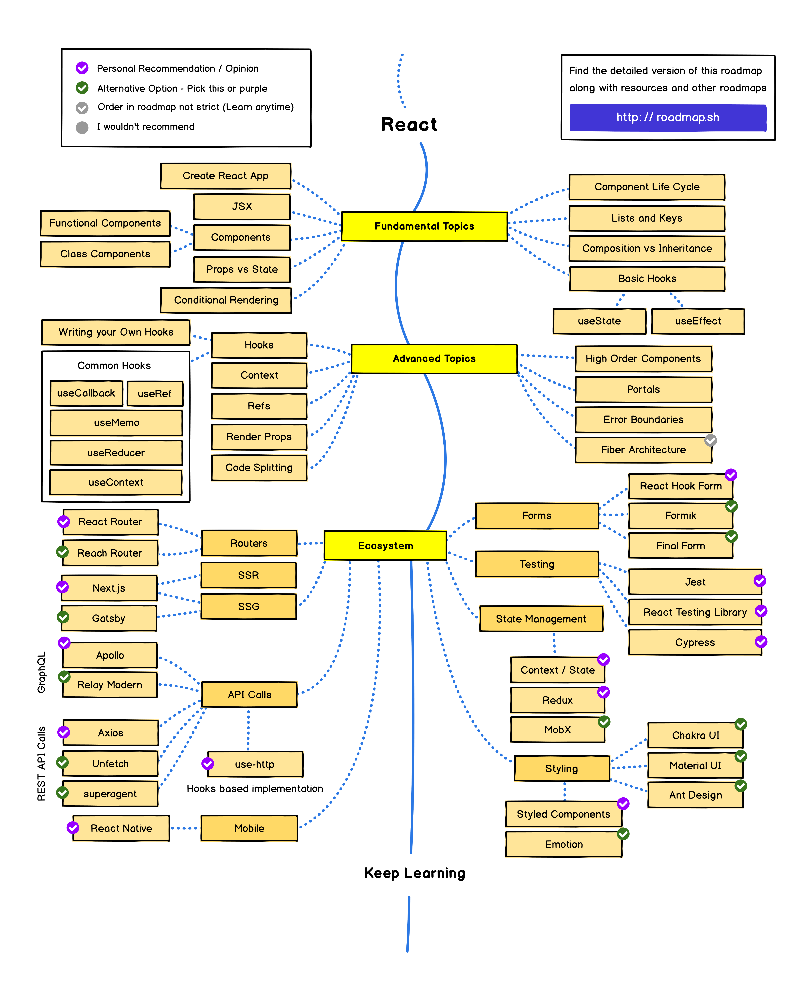

# react-roadmap
This repo if for who want to be a react developer

## Initial requirements
 - install vscode [Link](https://code.visualstudio.com/)
 - sign in [freecodecamp.org](https://www.freecodecamp.org/learn/)

<a class="btnfire small stroke"><em class="fas fa-chevron-circle-down"></em>&nbsp;&nbsp;Javascript Fundamentals</a>    

### 🔰 Introduction
 - [An Introduction to JavaScript](https://javascript.info/intro)
 - [Developer console](https://javascript.info/devtools)
 - [Hello world](https://javascript.info/hello-world)

### 🔰 JavaScript Fundamentals
 - [Variables](https://javascript.info/variables)
 - [Data types](https://javascript.info/types)
 - [Interaction: alert, prompt, confirm](https://javascript.info/alert-prompt-confirm)
 - [Basic operators, maths](https://javascript.info/operators)
 - [Comparisons](https://javascript.info/comparison)
 - **[Homework](javascript/homework/javascript_fundamentals.md)**

### 🔰 Operators
 - [Conditional branching: if, '?'](https://javascript.info/ifelse)
 - [Logical operators](https://javascript.info/logical-operators)
 - [Nullish coalescing operator '??'](https://javascript.info/nullish-coalescing-operator)
 - [Loops: while and for](https://javascript.info/while-for)
 - [The "switch" statement](https://javascript.info/switch)
  - **[Homework](javascript/homework/operators.md)**

### 🔰 Data types
 - [Primitives](https://javascript.info/primitives-methods)
 - [Numbers](https://javascript.info/number)
 - [Strings](https://javascript.info/string)
 - [Arrays](https://javascript.info/array)
 - [Array methods](https://javascript.info/array-methods)
 - [Destructuring methods](https://javascript.info/destructuring-assignment)

### 🔰 Functions
 - [Functions](https://javascript.info/function-basics)
 - [Function expressions](https://javascript.info/function-expressions)
 - [Arrow functions, the basics](https://javascript.info/arrow-functions-basics)
 - [The "new Function" syntax](https://javascript.info/new-function)
 - [Decorators and forwarding, call/apply](https://javascript.info/call-apply-decorators)
 - [Function binding](https://javascript.info/bind)
 - **[Homework](javascript/homework/functions.md)**

### 🔰 Objects
 - [Objects](https://javascript.info/object)
 - [Primitives](https://javascript.info/primitives-methods)
 - [Reference Type](https://javascript.info/reference-type)
 - [Object references and copying](https://javascript.info/object-copy)
 - [Object keys](https://javascript.info/keys-values-entries)
 - [Garbage collection](https://javascript.info/garbage-collection)
 - [Object methods, "this"](https://javascript.info/object-methods)
 - [Constructor, operator "new"](https://javascript.info/constructor-new)
 - [Optional chaining '?'](https://javascript.info/optional-chaining)
 - [JSON](https://javascript.info/json)
 - 
 - **[Homework](javascript/homework/objects.md)**

### 🔰 Additional topics part one
 - [Rest parameters and spread syntax](https://javascript.info/rest-parameters-spread)
 - [Data time](https://javascript.info/date)
 - [Variable scope, closure](https://javascript.info/closure)
 - [Global object](https://javascript.info/global-object)
 - [Scheduling: setTimeout and setInterval](https://javascript.info/settimeout-setinterval)
 - [Arrow functions revisited](https://javascript.info/arrow-functions)

### 🔰 Main Concepts
- [Hello World](https://reactjs.org/docs/hello-world.html)
- [Introducing JSX](https://reactjs.org/docs/introducing-jsx.html)
- [Rendering Elements](https://reactjs.org/docs/rendering-elements.html)
- [Components and Props](https://reactjs.org/docs/components-and-props.html)
- [State and Lifecycle](https://reactjs.org/docs/state-and-lifecycle.html)
- [ Handling Events](https://reactjs.org/docs/handling-events.html)
- [Conditional Rendering](https://reactjs.org/docs/conditional-rendering.html)
- [Lists and Keys](https://reactjs.org/docs/lists-and-keys.html)
- [Forms](https://reactjs.org/docs/forms.html)
- [Lifting State Up](https://reactjs.org/docs/lifting-state-up.html)
- [Composition vs Inheritance](https://reactjs.org/docs/lifting-state-up.html)
- [Thinking In React](https://reactjs.org/docs/thinking-in-react.html)

### 🔰 ADVANCED GUIDES
- [Accessibility](https://reactjs.org/docs/accessibility.html)
- [Code-Splitting](https://reactjs.org/docs/code-splitting.html)
- [Context](https://reactjs.org/docs/context.html)
- [Error Boundaries](https://reactjs.org/docs/error-boundaries.html)
- [Forwarding Refs](https://reactjs.org/docs/forwarding-refs.html)
- [Fragments](https://reactjs.org/docs/fragments.html)
- [Higher-Order Components](https://reactjs.org/docs/higher-order-components.html)
- [Integrating with Other Libraries](https://reactjs.org/docs/integrating-with-other-libraries.html)
- [JSX In Depth](https://reactjs.org/docs/jsx-in-depth.html)
- [Optimizing Performance](https://reactjs.org/docs/optimizing-performance.html)
- [Portals](https://reactjs.org/docs/portals.html)
- [Profiler](https://reactjs.org/docs/profiler.html)
- [React Without ES6](https://reactjs.org/docs/react-without-es6.html)
- [React Without JSX](https://reactjs.org/docs/react-without-jsx.html)
- [Reconciliation](https://reactjs.org/docs/reconciliation.html)
- [Refs and the DOM](https://reactjs.org/docs/refs-and-the-dom.html)
- [Render Props](https://reactjs.org/docs/render-props.html)
- [Static Type Checking](https://reactjs.org/docs/static-type-checking.html)
- [Strict Mode](https://reactjs.org/docs/strict-mode.html)
- [Typechecking With PropTypes](https://reactjs.org/docs/typechecking-with-proptypes.html)
- [Uncontrolled Components](https://reactjs.org/docs/uncontrolled-components.html)
- [Web Components](https://reactjs.org/docs/web-components.html)
- []
  

 ### 🔰 API REFERENCE
- [React](https://reactjs.org/docs/react-api.html)
- [React.Component](https://reactjs.org/docs/react-component.html)
- [ReactDOM](https://reactjs.org/docs/react-dom.html)
- [ReactDOMServer](https://reactjs.org/docs/react-dom-server.html)
- [DOM Elements](https://reactjs.org/docs/dom-elements.html)
- [SyntheticEvent](https://reactjs.org/docs/events.html)
- [Test Utilities](https://reactjs.org/docs/test-utils.html)
- [Test Renderer](https://reactjs.org/docs/test-renderer.html)
- [JS Environment Requirements](https://reactjs.org/docs/javascript-environment-requirements.html)
- [Glossaryhttps://reactjs.org/docs/glossary.html]

### 🔰 HOOKS
- [Introducing Hooks](https://reactjs.org/docs/hooks-intro.html)
- [Hooks at a Glance](https://reactjs.org/docs/hooks-overview.html)
- [Using the State Hook](https://reactjs.org/docs/hooks-state.html)
- [Using the Effect Hook](https://reactjs.org/docs/hooks-effect.html)
- [Rules of Hooks](https://reactjs.org/docs/hooks-rules.html)
- [Building Your Own Hooks](https://reactjs.org/docs/hooks-custom.html)
- [Hooks API Reference](https://reactjs.org/docs/hooks-reference.html)
- [ Hooks FAQ](https://reactjs.org/docs/hooks-faq.html)

<a class="btnfire small stroke"><em class="fas fa-chevron-circle-down"></em>&nbsp;&nbsp;More deep Javascript </a>    

### 🔰 Class 
 - [Class basic syntax](https://javascript.info/class)
 - [Class inheritance](https://javascript.info/class-inheritance)
 - [Static properties and methods](https://javascript.info/static-properties-methods)
 - [Private and protected properties and methods](https://javascript.info/private-protected-properties-methods)
 - [Extending built-in classes](https://javascript.info/extend-natives)

### 🔰 Additional topics part two
 - [Error handling, "try...catch"](https://javascript.info/try-catch)
 - [Custom errors, extending Error](https://javascript.info/custom-errors)
 - [Modules, introduction](https://javascript.info/modules-intro)
 - [Export and Import](https://javascript.info/import-export)
 - [Dynamic imports](https://javascript.info/modules-dynamic-imports)
 - [Mixins](https://javascript.info/mixins)

### 🔰 Promise async/await
 - [Introduction: callbacks](https://javascript.info/callbacks)
 - [Promise](https://javascript.info/promise-basics)
 - [Promises chaining](https://javascript.info/promise-chaining)
 - [Error handling with promises](https://javascript.info/promise-error-handling)
 - [Async/await](https://javascript.info/async-await)
 - [Generators](https://javascript.info/generators)
 - [Async iteration and generators](https://javascript.info/async-iterators-generators)

### 🔰 Network requests
 - [Fetch](https://javascript.info/fetch)
 - [FormData](https://javascript.info/formdata)
 - [Fetch progress](https://javascript.info/fetch-progress)

<a class="btnfire small stroke"><em class="fas fa-chevron-circle-down"></em>&nbsp;&nbsp;Transforming into User Interface </a>    

### 🔰 DOM
 - [Browser environment, specs](https://javascript.info/browser-environment)
 - [DOM tree](https://javascript.info/dom-nodes)
 - [Walking the DOM](https://javascript.info/dom-navigation)
 - [Searching: getElement*, querySelector*](https://javascript.info/searching-elements-dom)
 - [Node properties: type, tag and contents](https://javascript.info/basic-dom-node-properties)
 - [Attributes and properties  ](https://javascript.info/dom-attributes-and-properties)
 - [Modifying the document](https://javascript.info/modifying-document)
 - [Styles and classes](https://javascript.info/styles-and-classes)
 - [Element size and scrolling](https://javascript.info/size-and-scroll)
 - [https://javascript.info/size-and-scroll-window](Window sizes and scrolling)
 - [Coordinates](https://javascript.info/coordinates)

### 🔰 Introduction to Events
 - [Introduction to browser events](https://javascript.info/introduction-browser-events)
 - [Bubbling and capturing](https://javascript.info/bubbling-and-capturing)
 - [Event delegation](https://javascript.info/event-delegation)
 - [Browser default actions](https://javascript.info/default-browser-action)
 - [Dispatching custom events](https://javascript.info/dispatch-events)

### 🔰 Introduction to Events

